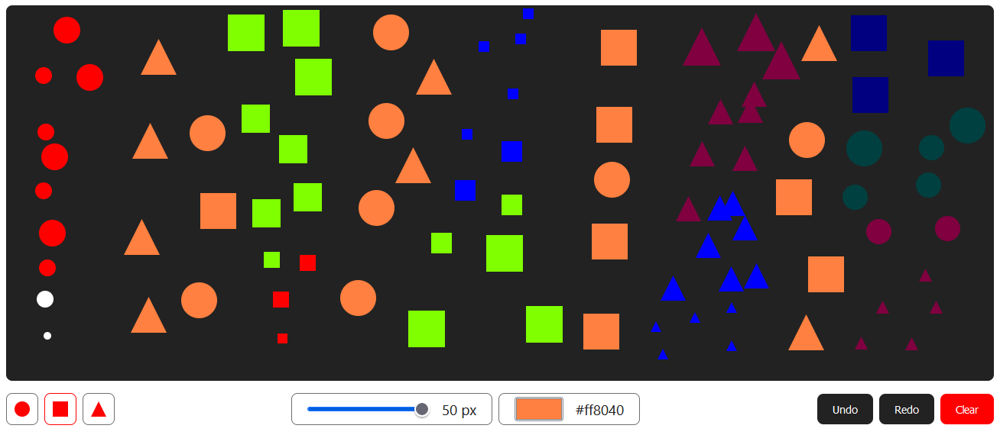

# Draw

Simple project built with React and TypeScript.
Inspired by [this video](https://www.youtube.com/watch?v=dOsBtM2U018).

# Features

- [x] Different shapes
  - [x] Circle
  - [x] Square
  - [x] Triangle
- [x] Change size of shapes
- [x] Clear
- [x] Change color
- [x] Preview
- [ ] Undo
- [ ] Redo

# Main page



# Runs the app

Install dependencies

```
npm install
```

Runs the app

```
npm start
```
